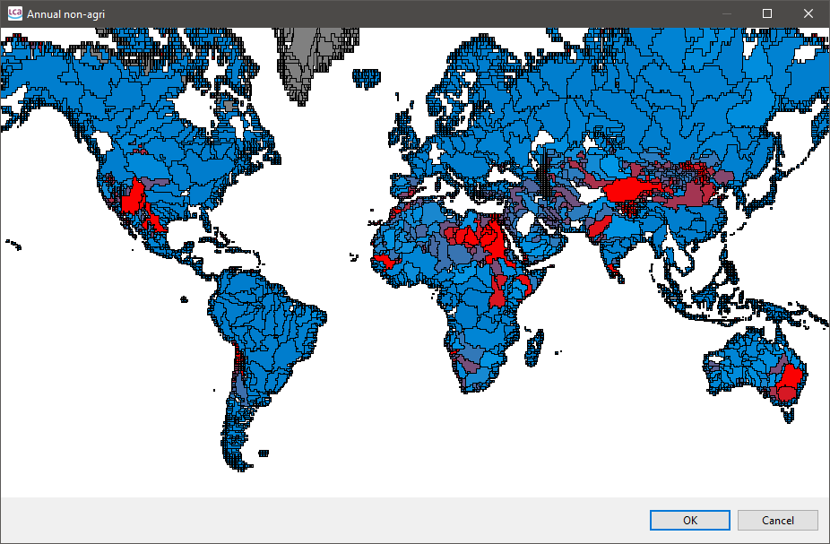

# awegeo
`awegeo` is a simple command line tool that converts the KML/KMZ file of the
AWARE method (the 'Google Layer Document' on the [download
page](https://wulca-waterlca.org/aware/download-aware-factors/)) into a
[GeoJSON](https://tools.ietf.org/html/rfc7946) file.

## Usage

* Download the
  [AWARE_v1_2April_7th.kmz_.zip](https://wulca-waterlca.org/aware/download-aware-factors/)
  file and extract it.
* You should find a `AWARE_v1_2April_7th.kmz` file which is also just a `zip`
  file that can be further extracted and you should get a `doc.kml` file.
* The `doc.kml` file can be converted using `awegeo` executable from the
  command line: 

```
usage:
  $ awegeo [path/to/doc.kml] [path/to/output.geojson]
```

The resulting GeoJSON file can be then used to create a regionalized LCIA method
in openLCA 2:



## Details

The placemarks in the AWARE KML files contain simple polygons. The attributes of
these polygons are stored in HTML tables within the description tags of the
respective placemarks:

```xml
<Placemark id="ID_00000">
  <description><![CDATA[
<html ...>
<head>
    ...
</head>
<body style="...">
 <table style="...">
  ...
</body>
</html>]]></description>
  <MultiGeometry>
    <Polygon>
      <outerBoundaryIs><LinearRing><coordinates>
        -38.00002600000005,83.49997399999998,0
        -38.00002600000005,83.99997399999998,0
        -38.50002600000005,83.99997399999998,0
        -38.50002600000005,83.49997399999998,0
        -38.00002600000005,83.49997399999998,0
      </coordinates></LinearRing></outerBoundaryIs>
    </Polygon>
  </MultiGeometry>
</Placemark>
```

A converted feature in GeoJSON looks then like this:

```json
{
  "type": "Feature",
  "geometry": {
    "type": "Polygon",
    "coordinates": [
      [
        [-56.50002600000005, 47.499974],
        [-56.50002600000005, 47.999974],
        [-56.00002600000005, 47.999974],
        [-56.00002600000005, 48.499974],
        [-56.50002600000005, 48.499974],
        [-57.00002600000005, 48.499974],
        [-57.00002600000005, 47.999974],
        [-57.00002600000005, 47.499974],
        [-56.50002600000005, 47.499974]
      ]
    ]
  },
  "properties": {
    "Annual non-agri": 0.3,
    "Apr": 0.2,
    "Area_m2": 6200000000,
    "Aug": 0.4,
    "Dec": 0.3,
    "FID": 5141,
    "Feb": 0.4,
    "Jun": 0.2,
    "Oct": 0.3,
    "id": "ID_05141"
  }
}
```